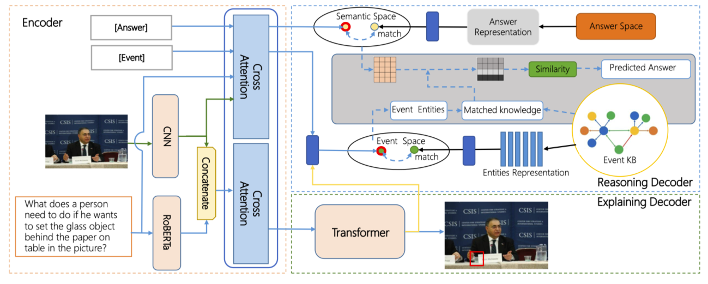
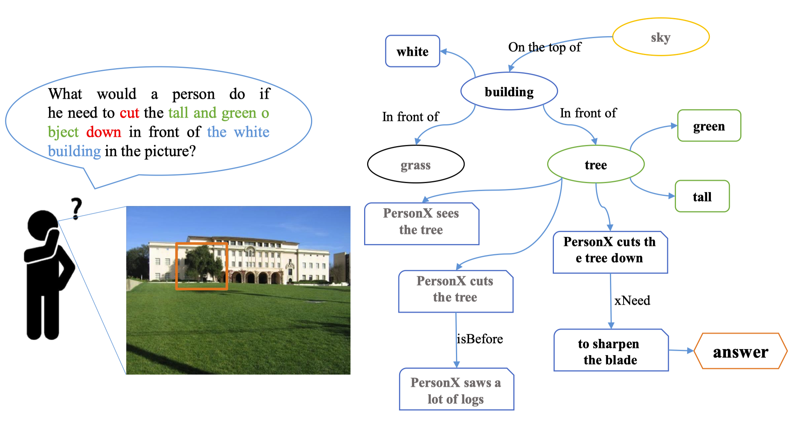
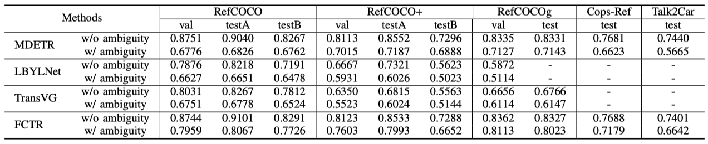

<div align="center">

# AI-VQA: Visual Question Answering based on Agent Interaction with Interpretability
English | [简体中文](ai-vqa_zh.md)



</div>

<br>


This is official repository for paper ********AI-VQA: Visual Question Answering based on Agent Interaction with Interpretability********

We present **A**gent **I**nteraction **V**isual **Q**uestion **A**nswering (AI-VQA), a task investigating deep scene understanding if the agent takes a certain action. To this end, this task needs to locate the interaction object and answer action-related questions to guarantee the model truly comprehends the human action. We propose a new model that builds upon one type of encoder-decoder model for alternative reason and explanation, called ARE, to address the three challenges of our task.

It is a proposed pipeline to the task AI-VQA mentioned in the paper ********AI-VQA: Visual Question Answering based on Agent Interaction with Interpretability********.

## Introduction
<div align="center">

</div>
We present the creation of a novel resource, a large-scale agent interaction visual question-answering dataset. We also believe that understanding and reasoning about an image should go beyond what is seen and that models should be able to pay attention to the consequence of an interaction. Our dataset enables the quantitative study of the agent interaction VQA and exhibits the impact of extra behaviors on the visual scene.

- We introduce the agent-interaction visual question-answering task, which requires answering questions that include reasoning about human activity beyond the given image and explaining how to obtain the answers.
- We build a novel dataset for the new AI-VQA task and help to improve the performance of a vision-language model in dealing with human action-related questions by investigating event knowledge outside the image.
- As the first-step exploration of this task, we study an encoder-decoder transformer model that explicitly joins explaining and answering components and facilitate the fusion of heterogeneous information, then assesses its performance and limitations.

<div align="center">


</div>

## Usage


## Getting Started
### Data Preparation

Please use the proposed datasets for training or testing.

**Further-RefCOCOs**: [Further-RefCOCOs download](xxx) Extract code: xxx
**Further-CopsRef**: [Further-CopsRef download](xxx) Extract code: xxx
**Further-Talk2Car**: [Further-Talk2Car download](xxx) Extract code: xxx


### How to train
Train model with default configuration

```bash
CUDA_VISIBLE_DEVICES=0,1,2,3  python train.py --config-name train_ai_vqa_8.1k_ACM trainer.gpus=4 +trainer.strategy=ddp trainer.gradient_clip_val=2 trainer.max_epochs=35
CUDA_VISIBLE_DEVICES=0,1,2,3  python train.py --config-name train_ai_vqa_42.9k_ACM trainer.gpus=4 +trainer.strategy=ddp trainer.gradient_clip_val=2 trainer.max_epochs=35
CUDA_VISIBLE_DEVICES=0,1,2,3  python train.py --config-name train_ai_vqa_144k_ACM trainer.gpus=4 +trainer.strategy=ddp trainer.gradient_clip_val=2 trainer.max_epochs=35

CUDA_VISIBLE_DEVICES=0,1,2,3  python train.py --config-name train_ai_vqa_8.1k_J trainer.gpus=4 +trainer.strategy=ddp trainer.gradient_clip_val=2 trainer.max_epochs=35
CUDA_VISIBLE_DEVICES=0,1,2,3  python train.py --config-name train_ai_vqa_42.9k_J trainer.gpus=4 +trainer.strategy=ddp trainer.gradient_clip_val=2 trainer.max_epochs=35
CUDA_VISIBLE_DEVICES=0,1,2,3  python train.py --config-name train_ai_vqa_144k_J trainer.gpus=4 +trainer.strategy=ddp trainer.gradient_clip_val=2 trainer.max_epochs=35
```


## Results and Models

<div align="center">


</div>

## Credits
The Reasoning Decoder code is sourced from **[MDETR](https://github.com/ashkamath/mdetr)**.  Thanks for their work.


## Citation
If you use this toolbox or benchmark in your research, please cite this project.
```bibtex
@inproceedings{10.1145/3503161.3548387,
author = {Li, Rengang and Xu, Cong and Guo, Zhenhua and Fan, Baoyu and Zhang, Runze and Liu, Wei and Zhao, Yaqian and Gong, Weifeng and Wang, Endong},
title = {AI-VQA: Visual Question Answering Based on Agent Interaction with Interpretability},
year = {2022},
isbn = {9781450392037},
publisher = {Association for Computing Machinery},
address = {New York, NY, USA},
url = {https://doi.org/10.1145/3503161.3548387},
doi = {10.1145/3503161.3548387},
booktitle = {Proceedings of the 30th ACM International Conference on Multimedia},
pages = {5274–5282},
numpages = {9},
location = {Lisboa, Portugal},
series = {MM '22}
}
```
