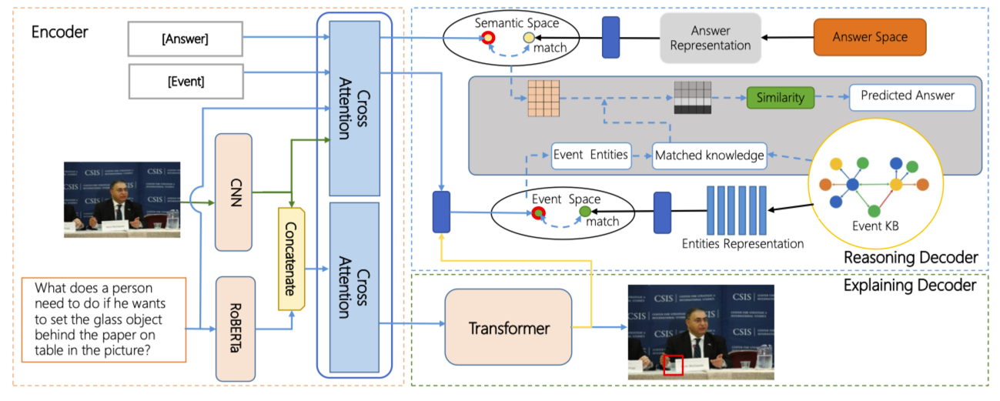
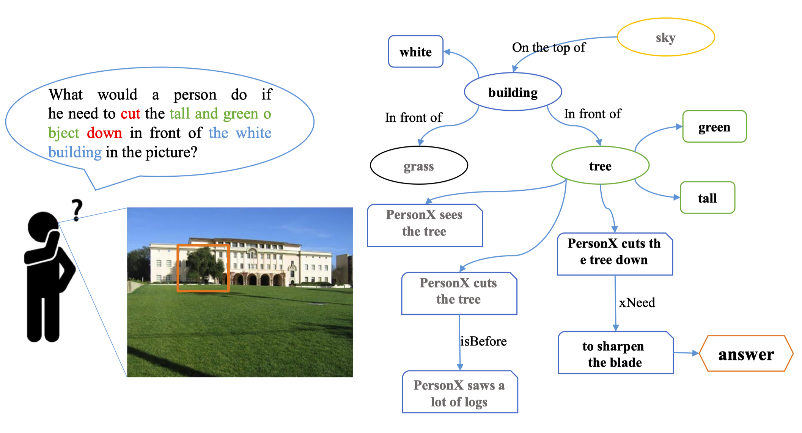
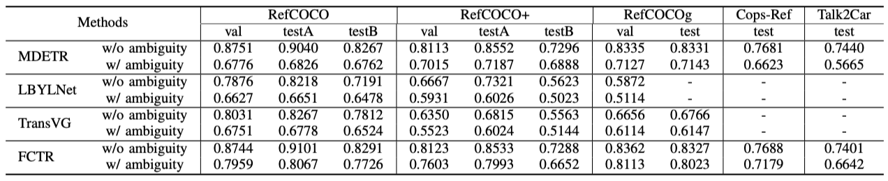

<div align="center">

# AI-VQA: Visual Question Answering based on Agent Interaction with Interpretability
[English](ai-vqa.md) | 简体中文



</div>

<br>

这是论文《*AI-VQA: Visual Question Answering based on Agent Interaction with Interpretability*》的官方库。

我们提出了**代理互动视觉问答**（AI-VQA），这是一项任务，研究代理在采取某种行动时的深度场景理解。为了达到这个目标，该任务需要定位交互对象并回答与行动相关的问题，以确保模型真正理解人类的行为。我们提出了一种新的模型，该模型基于一种用于替代推理和解释的编码器-解码器模型，称为ARE，以应对我们任务的三个挑战。

它是论文《*AI-VQA: Visual Question Answering based on Agent Interaction with Interpretability*》中提到的AI-VQA任务的一种解决方案。


## 简介
<div align="center">

</div>
我们介绍了一个 新人物，一个大规模的代理互动视觉问答数据集。我们同时认为，对图像的理解和推理应该超越视觉内容本身，并且模型应该能够关注交互的结果。我们的数据集使得能够定量研究与场景交互的VQA，并展示了外部行为对视觉场景的影响。

- 我们引入了场景交互视觉问答任务，该任务需要回答问题，包括对给定图像之外的人类行为进行推理，并解释如何获得答案。
- 我们为新的AI-VQA任务构建了一个新颖的数据集，并通过研究图像外的事件知识，帮助提高了视觉语言模型在处理与人类行为相关的问题时的表现。
- 作为这一任务的第一步探索，我们研究了一种将推理和问答模块结合在一起，并促进异构信息融合的编码器-解码器transformer模型，然后评估了其性能和局限性。

<div align="center">


</div>

## 用法

## 准备
### 数据

Please use the proposed datasets for training or testing.

**Further-RefCOCOs**: [Further-RefCOCOs download](xxx) Extract code: xxx
**Further-CopsRef**: [Further-CopsRef download](xxx) Extract code: xxx
**Further-Talk2Car**: [Further-Talk2Car download](xxx) Extract code: xxx


### 训练
Train model with default configuration

```bash
CUDA_VISIBLE_DEVICES=0,1,2,3  python train.py --config-name train_ai_vqa_8.1k_ACM trainer.gpus=4 +trainer.strategy=ddp trainer.gradient_clip_val=2 trainer.max_epochs=35
CUDA_VISIBLE_DEVICES=0,1,2,3  python train.py --config-name train_ai_vqa_42.9k_ACM trainer.gpus=4 +trainer.strategy=ddp trainer.gradient_clip_val=2 trainer.max_epochs=35
CUDA_VISIBLE_DEVICES=0,1,2,3  python train.py --config-name train_ai_vqa_144k_ACM trainer.gpus=4 +trainer.strategy=ddp trainer.gradient_clip_val=2 trainer.max_epochs=35

CUDA_VISIBLE_DEVICES=0,1,2,3  python train.py --config-name train_ai_vqa_8.1k_J trainer.gpus=4 +trainer.strategy=ddp trainer.gradient_clip_val=2 trainer.max_epochs=35
CUDA_VISIBLE_DEVICES=0,1,2,3  python train.py --config-name train_ai_vqa_42.9k_J trainer.gpus=4 +trainer.strategy=ddp trainer.gradient_clip_val=2 trainer.max_epochs=35
CUDA_VISIBLE_DEVICES=0,1,2,3  python train.py --config-name train_ai_vqa_144k_J trainer.gpus=4 +trainer.strategy=ddp trainer.gradient_clip_val=2 trainer.max_epochs=35
```


## Results and Models

<div align="center">


</div>

## Credits
本代码参考了 **[MDETR](https://github.com/ashkamath/mdetr)**.  


## Citation
若您在研究中使用本工具箱或基准，请引用本项目。
```bibtex
@inproceedings{10.1145/3503161.3548387,
author = {Li, Rengang and Xu, Cong and Guo, Zhenhua and Fan, Baoyu and Zhang, Runze and Liu, Wei and Zhao, Yaqian and Gong, Weifeng and Wang, Endong},
title = {AI-VQA: Visual Question Answering Based on Agent Interaction with Interpretability},
year = {2022},
isbn = {9781450392037},
publisher = {Association for Computing Machinery},
address = {New York, NY, USA},
url = {https://doi.org/10.1145/3503161.3548387},
doi = {10.1145/3503161.3548387},
booktitle = {Proceedings of the 30th ACM International Conference on Multimedia},
pages = {5274–5282},
numpages = {9},
location = {Lisboa, Portugal},
series = {MM '22}
}

