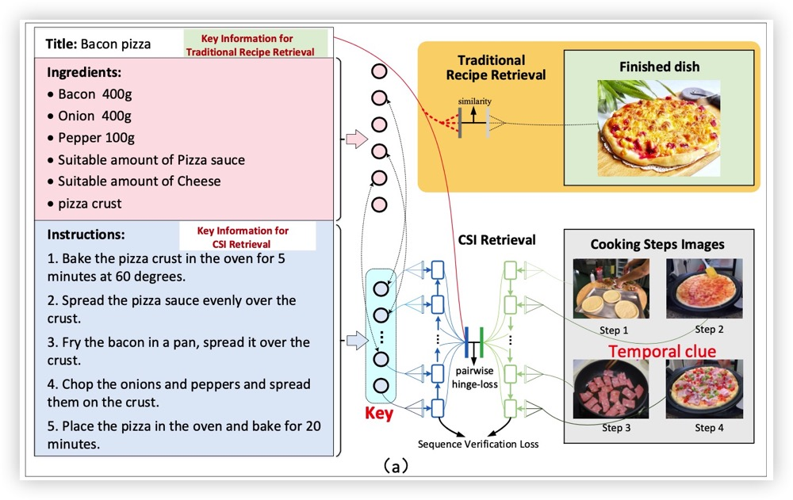
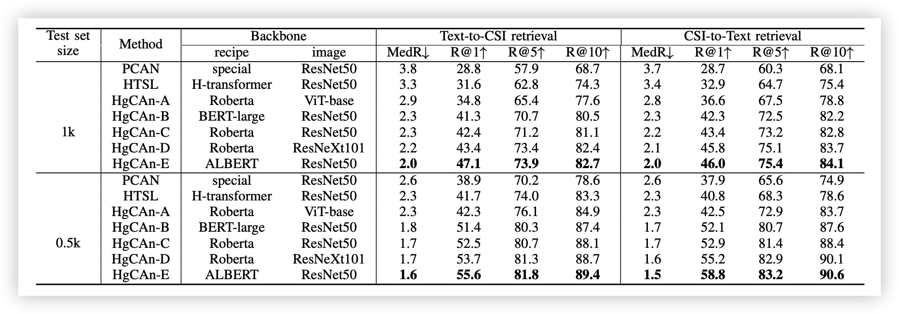

<div align="center">

# Heterogeneous Cross-Modal Recipe Retrieval on Cooking Step Images
[English](csi_recipe.md) | 简体中文

</div>

<br>
本项目提出一个基于时序步骤图片的检索框架，我们设计了注意力嵌入网络和BiLSTM来捕获时间序列信息，还采用异质图神经网络融合多结构文本信息，取得很好的效果。

<br>

## 菜谱检索任务


烹饪步骤图像检索(**CSIR**)指的是从以文字食谱为查询条件的烹饪步骤候选图像列表中 检索程序图像的问题，或如上图所示的反面。 为便于进一步开发这项任务，我们已将数 据、模型和代码开源。
1. 该代码旨在实现基于烹饪步骤图像的跨模态食谱检索。
2. 我们从多个菜谱网站收集了一个名为 CSI-Recipe 的新数据集。该数据集包含 12,330 份食谱和 109,330 张烹饪步骤图片。每份食谱都包括烹饪步骤图片、配料、说明和 标题，并配有中英文文本。
3. 我们通过引入异构图，为食谱检索任务提出了一种基准方法。我们的成分-指令异构 图可以动态增强关键指令语义。

## 使用方法
### 依赖库
安装 `dgl`库.
```bash
    pip install dgl
```


<br>

## 准备
### 数据

CSI-Recipe 任务涉及两种输入模式:图像和文本。为了提取相应的特征，我们使用了视 觉骨干网络和文本骨干网络。具体来说，我们使用 ResNet50、ResNeXt101 和 ViT 提取 图像特征，使用 Transform 提取文本特征。为了加快训练过程，我们预先提取了图像特 征并提供了下载链接
**Baidu NetDisk**: [CSI-Recipe features download](https://pan.baidu.com/s/1c249Nbr2IdvvHDjbrT0srA?pwd=miys) Extract code: miys 

**Google Drive**: [CSI-Recipe features download](https://drive.google.com/file/d/1YdP3jO0Qs1-SEXH6Hp15akTTeAlrMI8Y/view?usp=sharing)

数据集目前受版权保护，请联系我们([wang.lilc@ieisystem.com](wang.lilc@ieisystem.com)) 签署版权协议，我们将 通过电子邮件发送下载链接。
### 训练
使用默认配置训练模型:(ResNet50 视觉特征和 Roberta 文本特征)

```bash
CUDA_VISIBLE_DEVICES=0  python train.py --config-name train_recipe name=Roberta_ResNet50 trainer.gpus=1 trainer.gradient_clip_val=1.0  trainer.max_epochs=200 model.is_shuffle=False datamodule.num_workers=4
```

选择不同的主干网络对模型进行训练，见 [configs/datamodule](/configs/datamodule)

```bash
CUDA_VISIBLE_DEVICES=0    python train.py --config-name train_recipe_robeta_vitbase  name=Roberta_vitbase trainer.gpus=1 trainer.gradient_clip_val=1  trainer.max_epochs=200 model.is_shuffle=False datamodule.num_workers=4
CUDA_VISIBLE_DEVICES=0    python train.py --config-name train_recipe_bertlarge_resnet50  name=BERTlarge_ResNet50 trainer.gpus=1 trainer.gradient_clip_val=1.0  trainer.max_epochs=200 model.is_shuffle=False datamodule.num_workers=4
CUDA_VISIBLE_DEVICES=0    python train.py --config-name train_recipe_robeta_resnext101 name=Roberta_ResNeXt101 trainer.gpus=1 trainer.gradient_clip_val=1.0  trainer.max_epochs=200 model.is_shuffle=False datamodule.num_workers=4
CUDA_VISIBLE_DEVICES=0    python train.py --config-name train_recipe_albert_resnet50  name=albert_ResNet50 trainer.gpus=1 trainer.gradient_clip_val=1.0  trainer.max_epochs=200 model.is_shuffle=False datamodule.num_workers=4
```
<br>

## 实验结果
所有实验均在单GPU上进行训练，结果如下：



## 致谢
本项目中**GAT**(Graph Attention Network) 代码采用**[HeterSumGraph](https://github.com/dqwang122/HeterSumGraph)**.

## 引用
如果您在研究中使用本工具箱或基准，请引用本项目。
