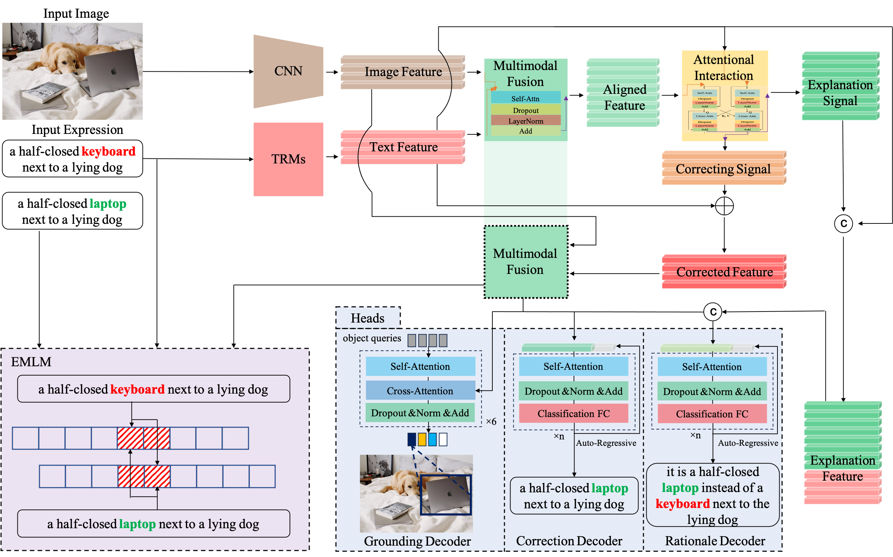
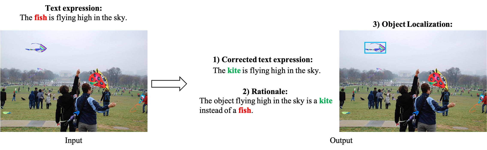
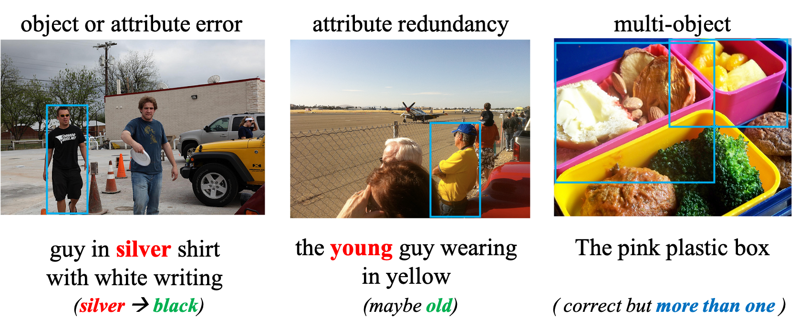

<div align="center">

# Further Comprehension via Transformers
English | [简体中文](fctr_frec_zh.md)



</div>

<br>


This is official repository for paper ***Inexactly Matched Referring Expression Comprehension with Rationale***

**FCTR** or **F**urther **C**omprehension via **TR**ansformers is a multimodal comprehension model for inexactly matched image-text pair samples.
It corrects the erroneous text expression using visual information, 
generates the rationale for this input expression, 
and localizes the proper object based on the corrected expression, simultaneously.

It is a proposed pipeline to the task FREC mentioned in the paper ***Inexactly Matched Referring Expression Comprehension with Rationale***.

## Inexactly Matched Referring Expression Comprehension with Rationale
### Further Referring Expression Comprehension

<div align="center">



</div>
Referring Expression Comprehension (REC) is a multimodal comprehension task that aims to locate an object in an image, given a text description. 
Traditionally, during the existing REC tasks, there has been a basic assumption that the given text expression and the image are usually exactly matched to each other. 
However, in real-world scenarios, there is uncertainty in how well the image and text match each other exactly. 
Illegible objects in the image or ambiguous phrases in the text have the potential to significantly degrade the performance of conventional REC tasks. 
To overcome these limitations, we consider a more practical and comprehensive REC task, where the given image and its referring text expression can be inexactly matched. 
Our models aim to correct such inexact matching and supply corresponding interpretations. 
We refer to this task as Further REC (FREC). 
This task is divided into three subtasks: 1) correcting the erroneous text expression using visual information, 2) generating the rationale for this input expression, and 3) localizing the proper object based on the corrected expression. 
We introduce three new datasets for FREC: Further-RefCOCOs, Further-Copsref and Further-Talk2Car.
These datasets are based on the existing REC datasets, including RefCOCO and Talk2Car.

<div align="center">


</div>

We focus on a comprehension process of a multimodal model on a referring text expression.
Our aim is that the model can correct, interpret, and localize error-containing expressions using image information and by simulating human comprehension.
Each sample within our datasets contains the following components: 1) an image, 2) an error-containing expression, 3) a correct expression, 4) a grounding label, and 5) more than one explanatory rationale.

For each sample, erroneous expressions are generated based on the correct expressions.
We first formulate which errors are joinable.
These errors would be valuable if corrected.
For this purpose, we first limit the mismatch between image and text by adding, modifying, or removing \textbf{\emph{only one}} piece of information that could be an object, an attribute, or a relationship between objects from the correct expression.
We then group the manual accession errors into three categories: 
1) object or attribute error, 
2) attribute redundancy, 
3) multi-object error.

### Further Comprehension via Transformers

FCTR or Further Comprehension using Transformers is our end-to-end pipeline that implements our three tasks simultaneously.
The pipeline consists of an image and text encoder, a multimodal fusion module, an attentional interaction module, and three heads for the different decoding tasks.
First, an image and its referring expression are encoded by convolutional networks and transformers.
Next, their features are sent into the fusion module to obtain the aligned feature between vision and language.
Next, the attentional interaction module uses the original text features to obtain two outputs: correcting and explanation signals.
Finally, these signals are fed to the various heads to achieve decoding for different tasks: expression correction, rationale generation, and target localization.

## Usage

## Getting Started
### Data Preparation

Please use the proposed datasets for training or testing.

**Further-RefCOCOs**: [Further-RefCOCOs download](xxx) Extract code: xxx
**Further-CopsRef**: [Further-CopsRef download](xxx) Extract code: xxx
**Further-Talk2Car**: [Further-Talk2Car download](xxx) Extract code: xxx

### How to train
Train model with default configuration

```bash
CUDA_VISIBLE_DEVICES=0,1,2,3 python train.py --config-name train_fctr_e_further_copsRef trainer.gpus=4 +trainer.strategy=ddp trainer.gradient_clip_val=0.1 trainer.max_epochs=20 trainer.check_val_every_n_epoch=21
CUDA_VISIBLE_DEVICES=0,1,2,3 python train.py --config-name train_fctr_further_refcocos trainer.gpus=4 +trainer.strategy=ddp trainer.gradient_clip_val=0.1 trainer.max_epochs=20 trainer.check_val_every_n_epoch=21
CUDA_VISIBLE_DEVICES=0,1,2,3 python train.py --config-name train_fctr_e_further_talk2car trainer.gpus=4 +trainer.strategy=ddp trainer.gradient_clip_val=0.1 trainer.max_epochs=20 trainer.check_val_every_n_epoch=21
```


## Results and Models
All experiments  were trained on an A100*16 server, and the results are as follows.

<div align="center">


</div>

## Credits
Our code refers **[MDETR](https://github.com/ashkamath/mdetr)**.

Thanks for their works.

## Citation
If you use this toolbox or benchmark in your research, please cite this project.

```bibtex
@inproceedings{li2022towards,
  title={Towards Further Comprehension on Referring Expression with Rationale},
  author={Li, Rengang and Fan, Baoyu and Li, Xiaochuan and Zhang, Runze and Guo, Zhenhua and Zhao, Kun and Zhao, Yaqian and Gong, Weifeng and Wang, Endong},
  booktitle={Proceedings of the 30th ACM International Conference on Multimedia},
  pages={4336--4344},
  year={2022}
}
@ARTICLE{10261300,
  author={Li, Xiaochuan and Fan, Baoyu and Zhang, Runze and Zhao, Kun and Guo, Zhenhua and Zhao, Yaqian and Li, Rengang},
  journal={IEEE Transactions on Multimedia}, 
  title={Inexactly Matched Referring Expression Comprehension with Rationale}, 
  year={2023},
  volume={},
  number={},
  pages={1-14},
  doi={10.1109/TMM.2023.3318289}}
```
