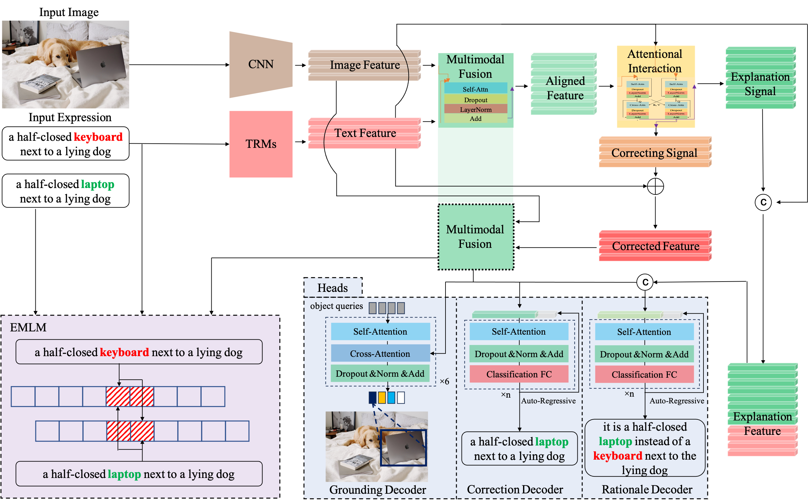
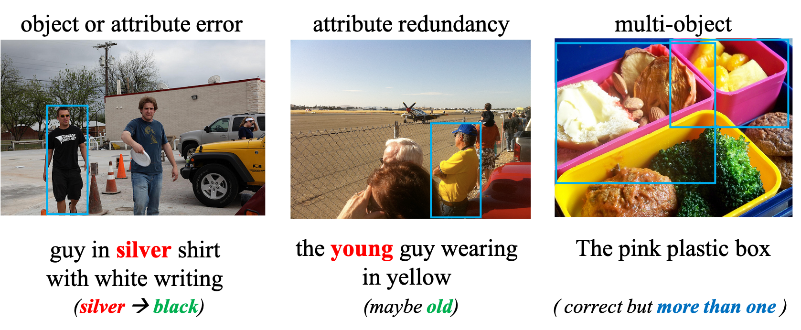

<div align="center">

# 基于Transformers模型的指代表达理解模型
[English](fctr_frec.md) | 简体中文


</div>

<br>


本代码为论文《 ***Inexactly Matched Referring Expression Comprehension with Rationale***》的官方工程。

**FCTR** 是一个多模态理解模型，适用于不完全匹配的图像-文本对样本。
它利用视觉信息纠正错误的文字表达，生成初始表达错误的理由，并根据纠正后的表达同时定位图像中正确的目标。

它是论文《 ***Inexactly Matched Referring Expression Comprehension with Rationale***》中提到的 FREC 任务的一条解决方案。


## 非精确匹配的可解释性指代表达理解
### FREC任务

<div align="center">


</div>
指代表达理解（REC）是一项多模态理解任务，目的是根据文字描述在图像中找到对象。
传统上，在现有的 REC 任务中，一个基本假设是给定的文本表达和图像通常是完全匹配的。
然而，在现实世界中，图像和文本的精确匹配程度存在不确定性。
图像中无法辨认的物体或文本中模棱两可的短语都有可能大大降低传统 REC 任务的性能。
为了克服这些局限性，我们考虑了一种更实用、更全面的 REC 任务，在这种任务中，给定的图像与其引用的文本表达可能不完全匹配。
我们的模型旨在纠正这种不精确匹配并提供相应的解释。
我们将这一任务称为进一步 REC（FREC）。
这项任务分为三个子任务： 1) 使用视觉信息纠正错误的文本表达；2) 生成用来解释输入表达错误的理由；3) 根据纠正后的表达定位正确的目标。
我们为 FREC 引入了三个新数据集： Further-RefCOCOs、Further-Copsref 和 Further-Talk2Car。
这些数据集基于现有的 REC 数据集，包括 RefCOCO 和 Talk2Car。

<div align="center">


</div>

我们的重点是多模态模型对指代文本表达的理解过程。
我们的目标是，该模型能够利用图像信息并通过模拟人类理解来纠正、解释和定位包含错误的表达。
我们数据集中的每个样本都包含以下组成部分： 1）一张图像；2）一个含错误的指代表达；3）一个正确的表达；4）对应目标准确的坐标；5）一个以上的解释理由。

在构造样本时,我们对于每个样本，都会根据正确的文本合成错误的指代表达。
我们首先确定哪些错误是可合并的。
我们认为只有可以被纠正的错误才是有意义的 (相反，若某些样本无法根据提供的图像和文本推测出那些字错了，则这种错误没有被纠正的意义)。
为此，我们首先通过添加、修改或删除正确表达式中可能是对象、属性或对象间关系的信息来限制图像和文本之间的不匹配。
然后，我们将人工加入错误分为三类： 
1) 对象或属性错误;
2) 属性冗余;
3) 多对象错误。


### 基于Transformers模型的指代表达理解模型


FCTR 是我们在论文中提出的端到端方法，可同时实现FREC的三项任务。
它包括一个图像和文本编码器、一个多模态融合模块、一个注意力交互模块和三个用于不同解码任务的头。
首先，通过卷积网络和转换器对图像及其引用表达进行编码。
然后，它们的特征被送入融合模块，以获得视觉和语言之间的对齐特征。
接下来，注意力交互模块使用原始文本特征获得两个输出：纠正信号和解释信号。
最后，这些信号被输送到不同的头部，以实现不同任务的解码：表达校正、解释性理由生成和图像目标定位。

## 使用方法


## 入门
### 数据准备

你可以使用我们提供的数据进行训练或测试。

**Further-RefCOCOs**: [Further-RefCOCOs download](xxx) 提取码: xxx

**Further-CopsRef**: [Further-CopsRef download](xxx) 提取码: xxx

**Further-Talk2Car**: [Further-Talk2Car download](xxx) 提取码: xxx


### 训练
使用默认配置进行训练:

```bash
CUDA_VISIBLE_DEVICES=0,1,2,3 python train.py --config-name train_fctr_e_further_copsRef trainer.gpus=4 +trainer.strategy=ddp trainer.gradient_clip_val=0.1 trainer.max_epochs=20 trainer.check_val_every_n_epoch=21
CUDA_VISIBLE_DEVICES=0,1,2,3 python train.py --config-name train_fctr_further_refcocos trainer.gpus=4 +trainer.strategy=ddp trainer.gradient_clip_val=0.1 trainer.max_epochs=20 trainer.check_val_every_n_epoch=21
CUDA_VISIBLE_DEVICES=0,1,2,3 python train.py --config-name train_fctr_e_further_talk2car trainer.gpus=4 +trainer.strategy=ddp trainer.gradient_clip_val=0.1 trainer.max_epochs=20 trainer.check_val_every_n_epoch=21
```


## 实验结果
所有实验都在 A100*16 服务器上进行了训练，结果如下:

<div align="center">


</div>

## 致谢
本代码参考了 **[MDETR](https://github.com/ashkamath/mdetr)**。

感谢他们的贡献。

## 引用声明
如果您在研究中使用本工具箱或基准，请引用本项目。
```bibtex
@inproceedings{li2022towards,
  title={Towards Further Comprehension on Referring Expression with Rationale},
  author={Li, Rengang and Fan, Baoyu and Li, Xiaochuan and Zhang, Runze and Guo, Zhenhua and Zhao, Kun and Zhao, Yaqian and Gong, Weifeng and Wang, Endong},
  booktitle={Proceedings of the 30th ACM International Conference on Multimedia},
  pages={4336--4344},
  year={2022}
}
@ARTICLE{10261300,
  author={Li, Xiaochuan and Fan, Baoyu and Zhang, Runze and Zhao, Kun and Guo, Zhenhua and Zhao, Yaqian and Li, Rengang},
  journal={IEEE Transactions on Multimedia}, 
  title={Inexactly Matched Referring Expression Comprehension with Rationale}, 
  year={2023},
  volume={},
  number={},
  pages={1-14},
  doi={10.1109/TMM.2023.3318289}}
```


