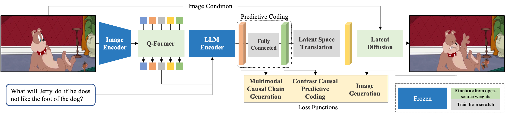
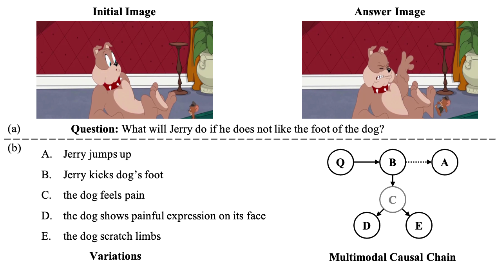
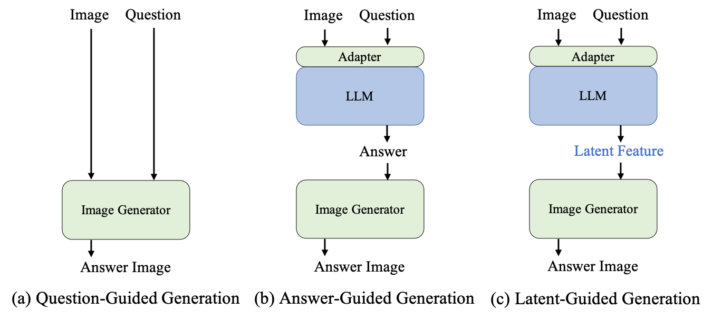

<div align="center">

# Latent-Guided Diffusion Model using Large Language Models
English | [简体中文](lgd_vqai_zh.md)



</div>

<br>


This is official repository for paper ***Image Content Generation with Causal Reasoning***

**LGD** or Latent-Guided Diffusion Model using Large Language Models is a method used for image causal content generation.
Specifically, LGD outputs a generated new image as an answer based on a given image and a question, which is the proposed VQAI task proposed in paper *Image Content Generation with Causal Reasoning*.


## Image Content Generation with Causal Reasoning
### Visual Question Answering with Image

<div align="center">


</div>
The emergence of ChatGPT has once again sparked research in generative artificial intelligence (GAI).
While people have been amazed by the generated results, they have also noticed the reasoning potential reflected in the generated textual content. 
However, this current ability for causal reasoning is primarily limited to the domain of language generation, such as in models like GPT-3.
In visual modality, there is currently no equivalent research.
Considering causal reasoning in visual content generation is significant.
This is because visual information contains infinite granularity.
Particularly, images can provide more intuitive and specific demonstrations for certain reasoning tasks, especially when compared to coarse-grained text.
Hence, we propose a new image generation task called visual question answering with image (VQAI) and establish a dataset of the same name based on the classic *Tom and Jerry* animated series. 

<div align="center">


</div>

For the prompt VQAI task, we produce a new dataset.
All pictures used in the dataset are sampled from the *Tom and Jerry* cartoon series.
We adopt this cartoon for several main reasons.
* First, compared to the complex scenes of nature, the worldview of cartoons is often simplified.  
* Second, *Tom and Jerry* attaches great importance to the presentation of visuals. Compared with some other animated films, this cartoon ignores the necessity of language as much as possible.
* Besides, as an animated film, the changes in backgrounds, characters, and objects are relatively controllable. This facilitates our first attempt at this task and method validation. Meanwhile, it reduces the difficulty of data collection.

We provide annotators with five strict templates to select image pairs from the video and write causal questions. 
In short, given an image pair, it is valid when and only if it satisfies one of the following rules:
* **Scenery Variation**: the scene or environment is modified, such as changes in weather, brightness, and season.
* **More Entities**: the scene has not been modified, but one or more entities have been added.
* **Fewer Entities**: the scene has not been modified, but one or more entities have been reduced.
* **Entities Variation**: the modifications to the scenario are minor with no additions or subtractions of entities.
* **Emotion Variation**: one or more characters' emotions change, accompanied by expressions or movements.

<div align="center">


</div>

### Latent-Guided Diffusion Model

We think about causal reasoning and image content generation.
Specifically, one of the most straightforward solutions is to use an off-the-shelf image editing model, such as InstructPix2Pix, if only the matching of the model to the data structure is considered.
We refer to this approach as **Question-Guided Generation**.
However, since the input text does not contain explicit information for modification, it is risky to use only an image editor.
It may not have the ability to causal reasoning.
Therefore, we consider cascading a reasoning module before the image-decoding model.

The reasoning ability of large language models (LLMs) is widely recognized.
In the multimodal domain, some approaches have inserted adapters in LLM and verified that LLM maintains reasoning ability over multimodality on tasks such as VQA and image captioning.
Therefore, it is worth borrowing the inference capability of LLM in the causal image generation process.
In this work, we consider two different paradigms, and refer to them as **Answer-Guided Generation** and **Latent-Guided Generation**, respectively.
One is to use LLM to reason about the textual output for multimodal inputs and use that answer to guide the editing model.
However, since images are far more information-rich than text, this may introduce new risks.
It requires considerable textual description to replace the equivalent amount of information in an image.
This may exceed the editing model's comprehension capability and even the token length limit.
In this study, we propose a new generative paradigm that uses the encoding features of LLM to guide the image generation model.

<div align="center">



</div>

We propose a new method based on LLM with a diffusion model called **Latent Guided Diffusion (LGD)**.
For the use of LLM, we introduce the Q-Former in the BLIP2.
Q-Former initializes a set of fixed-length query tokens and translates the image information into features that the LLM encoder can read by making cross attention to the image features.
These features are concatenated together with the embeddings of language prompts (interrogatives or other forms of instances) to implement different downstream tasks.
As shown in the figure, we use the same form of extracting multimodal features for images and causal interrogatives and use them to guide image decoding.
On the image decoding side, we refer to the related work of Stable Diffusion and InstructPix2Pix to fuse the features used for guidance into different stages of UNet through the attention mechanism.

## Usage
### Requirements
You need to install `transformers` before using it.
```bash
    pip install transformers>=4.26.1
```

## Getting Started
### Data Preparation

Please use the proposed VQAI data for training or testing.

**Baidu NetDisk**: [VQAI download](https://pan.baidu.com/s/1XQKCy0EBioCVnYJp3cHD9w?pwd=avr3) Extract code: avr3

### How to test
```bash
CUDA_VISIBLE_DEVICES=cuda_id python validate.py --config-name eval_vqai.yaml trainer.gpus=1 model.evaluate.generate_img_dir=output_dir  ckpt_path=ckpt_path
```

### How to train
Train model with default configuration

```bash
CUDA_VISIBLE_DEVICES=0,1,2,3 python train.py --config-name train_vqai trainer.gpus=4 trainer.max_epochs=70
```


## Results and Models
All experiments  were trained on an A100*8 server, and the results are as follows.

<div align="center">


</div>

## Credits
Our code refers **[Stable Diffusion](https://github.com/CompVis/stable-diffusion)**, 
**[LAVIS](https://github.com/salesforce/LAVIS)**, 
and **[InstructPix2Pix](https://github.com/timothybrooks/instruct-pix2pix)**.

Thanks for their works.

## Legal Sourcing and Intended Usage

All the videos used in the collection of VQAI are sourced from the *Tom and Jerry* animated series, which is copyrighted material.
Hence, we follow Fair Use §107: `the fair use of a copyrighted work, including such use by ... scholarship, or research, is not an infringement of copyright`, where fair use is determined by `the purpose and character of the use, including whether such use is of a commercial nature or is for nonprofit educational purposes`, `the amount and substantiality of the portion used in relation to the copyrighted work as a whole`, and `the effect of the use upon the potential market for or value of the copyrighted work.`
Hence, the VQAI datasets are noncommercial and should only be used for the purpose of academic research.

The videos used during data collection are be under copyright, so we do not provide an official license and rely on Fair Use §107.
Our annotations are available under a CC BY-SA 4.0 license.

## Citation
If you use this toolbox or benchmark in your research, please cite this project.
