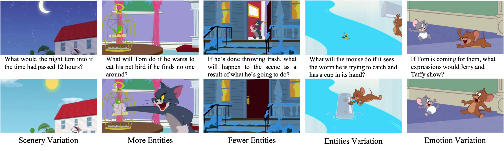

<div align="center">

# 基于大语言模型的隐空间指导扩散模型
[English](lgd_vqai.md) | 简体中文


</div>

<br>

本代码为论文《***Image Content Generation with Causal Reasoning***》的官方工程。

基于大语言模型的隐空间指导扩散模型(隐指扩散模型, LGD)是一种用于生成图像因果内容的方法。
LGD 根据给定图像和文本问题输出生成的新图像作为答案，即论文《*Image Content Generation with Causal Reasoning*》中提出的VQAI任务。

## 因果图像内容生成
### 图像视觉问答VQAI

<div align="center">


</div>

ChatGPT 的出现再次引发了对生成式人工智能 (GAI) 的研究。
人们在惊叹于生成结果的同时，也注意到了生成文本内容所反映出的推理潜力。
然而，目前这种因果推理能力主要局限于语言生成领域，如 GPT-3 等模型。
在视觉模式方面，目前还没有类似的研究。
在视觉内容生成中考虑因果推理的意义重大。
这是因为视觉是一种无限细粒度的信息。
尤其是与粗粒度文本相比，图像可以为某些推理任务提供更直观、更具体的演示。
因此，我们提出了一种新的图像生成任务，称为图像视觉问题解答 (VQAI)，并基于经典的《**猫和老鼠**》系列动画片建立了同名数据集。

<div align="center">


</div>

我们提出了一个 VQAI 数据集。
数据集中使用的所有图片均取自《**猫和老鼠**》系列动画片。
我们采用这部动画片有几个主要原因:
* 首先，与复杂的自然景象相比，动画片的世界观往往是简化的。 
* 其次，《猫和老鼠》非常重视视觉效果的呈现。与其他一些动画片相比，这部动画片极尽可能地弱化了语言或台词。
* 此外，作为一部动画片，背景、人物和物体的变化相对可控。这为我们的首次尝试和方法验证提供了便利。同时，也降低了数据收集的难度。

对于样本标注，我们为标注人员提供了五种严格的模板，让他们从视频中选择图像对并编写因果问题。
简而言之，对于给定的一组图像，当且仅当它满足以下规则之一时，它才是合格的 (符合因果性的)：
* **场景变化**: 场景或环境发生变化，如天气、亮度和季节的变化。
* **实体增加**: 场景未被修改，但添加了一个或多个实体。
* **实体减少**: 场景未被修改，但减少了一个或多个实体。
* **实体变化**: 对场景的修改很小，没有增加或减少实体。
* **情绪变化**: 一个或多个角色的情绪发生变化，并伴有表情或动作。

<div align="center">



</div>

### 隐指扩散模型

我们进一步思考了因果推理和图像内容生成的方法。
具体来说，如果只考虑模型与数据结构的匹配，最直接的解决方案之一就是使用现成的图像编辑模型，如 InstructPix2Pix。
我们将这种方法称为**问题引导生成 (QGD)**。
不过，由于输入文本不包含明确的修改信息，因此仅使用图像编辑器是有风险的。
它可能不具备因果推理能力。
因此，我们考虑在图像解码模型之前级联一个推理模块。

大型语言模型（LLM）的推理能力已得到广泛认可。
在多模态领域，一些方法在 LLM 中插入了适配器，并验证了 LLM 在 VQA 和图像字幕等任务中保持了多模态推理能力。
因此，在因果图像生成过程中，LLM 的推理能力值得借鉴。
在这项工作中，我们考虑了两种不同的范式，分别称为**答案引导生成 (AGD)**和**隐空间特征引导生成 (LGD)**。
一种是使用 LLM 来推理多模态输入的文本输出，并使用该答案来指导编辑模型。
不过，由于图像的信息量远比文本丰富，这可能会带来新的风险。
要取代图像中的同等信息量，需要大量的文字描述。
这可能会超出编辑模型的理解能力，甚至超出 tokens 长度的限制。
在本研究中，我们提出了一种新的生成范式，利用 LLM 的编码特征来指导图像生成模型。

<div align="center">


</div>

我们提出了一种基于 LLM 的新方法，该方法的扩散模型被称为 **隐指扩散模型（LGD）**。
为了使用 LLM，我们在 BLIP2 中引入了 Q-Former。
Q-Former 对一组固定长度的查询标记进行初始化，并将图像信息转化为 LLM 编码器可以通过交叉关注图像特征来读取的特征。
这些特征与语言提示（问句或其他形式的实例）的嵌入连接在一起，以执行不同的下游任务。
如图所示，我们采用相同的形式提取图像和因果问句的多模态特征，并用它们来指导图像解码。
在图像解码方面，我们参考了 Stable Diffusion 和 InstructPix2Pix 的相关工作，通过注意力机制将用于引导的特征融合到 UNet 的不同阶段。

## 使用方法
### 依赖
安装 `transformers`
```bash
    pip install transformers>=4.26.1
```

## 入门
### 数据准备

请使用所提 VQAI 数据进行训练或测试。

**下载链接 (百度网盘)**: [VQAI download](https://pan.baidu.com/s/1XQKCy0EBioCVnYJp3cHD9w?pwd=avr3) 提取码: avr3

### 测试
```bash
CUDA_VISIBLE_DEVICES=cuda_id python validate.py --config-name eval_vqai.yaml trainer.gpus=1 model.evaluate.generate_img_dir=output_dir  ckpt_path=ckpt_path
```

### 训练
使用默认配置进行训练:

```bash
CUDA_VISIBLE_DEVICES=0,1,2,3 python train.py --config-name train_vqai trainer.gpus=4 trainer.max_epochs=70
```


## 实验结果
所有实验都在 A100*8 服务器上进行了训练，结果如下:

<div align="center">


</div>

## 致谢
本代码参考了 **[Stable Diffusion](https://github.com/CompVis/stable-diffusion)**, 
**[LAVIS](https://github.com/salesforce/LAVIS)**, 
与 **[InstructPix2Pix](https://github.com/timothybrooks/instruct-pix2pix)** 。

感谢他们的贡献。

## 合法来源和预期用途

VQAI 收集使用的所有视频均来自《猫和老鼠》系列动画，该系列动画受版权保护。
因此，我们遵循《Fair Use》第 107 条:
`the fair use of a copyrighted work, including such use by ... scholarship, or research, is not an infringement of copyright`, 在这种情况下，确定合理使用的标准是 `the purpose and character of the use, including whether such use is of a commercial nature or is for nonprofit educational purposes`, `the amount and substantiality of the portion used in relation to the copyrighted work as a whole`, and `the effect of the use upon the potential market for or value of the copyrighted work.`
因此，VQAI 数据集是非商业性的，只能用于学术研究目的。

数据收集过程中使用的视频受版权保护，因此我们不提供官方许可，而是依据第 107 条 "合理使用 "的规定。
我们的注释采用 CC BY-SA 4.0 许可。

## 引用声明
若您在研究中使用本工具箱，请引用本项目。
